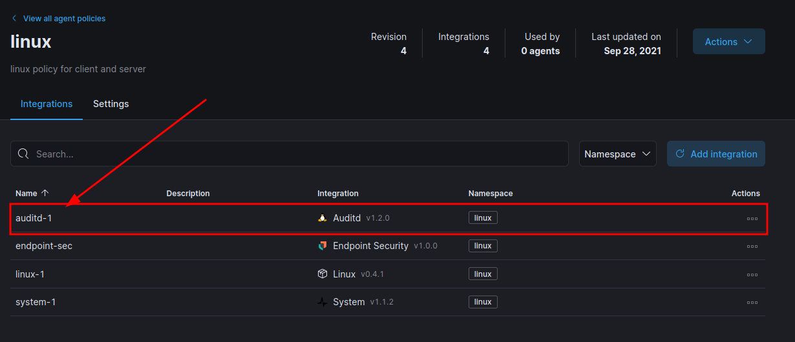

# SETUP

```sh
    MVladislav
```

---

- [SETUP](#setup)
  - [services](#services)
    - [auditd](#auditd)
  - [References](#references)

---

## services

### auditd

> can be used with **fleet agent** to collect logs
> 

install:

```sh
$sudo apt install auditd audispd-plugins
```

get base rule and copy/load into base folder:

```sh
$sudo wget -O /etc/audit/rules.d/audit.rules https://raw.githubusercontent.com/Neo23x0/auditd/master/audit.rules
```

make some changes to conf file, that following lines looks like this:

```conf
## Ignore current working directory records
# -a always,exclude -F msgtype=CWD

...


# Make The Configuration Immutable --------------------------------------------

-e 2
```

restart it.

```sh
$sudo service auditd restart
$sudo service omid restart
```

---

## References

- <https://github.com/Neo23x0/auditd>
  - <https://www.youtube.com/watch?v=lc1i9h1GyMA>
